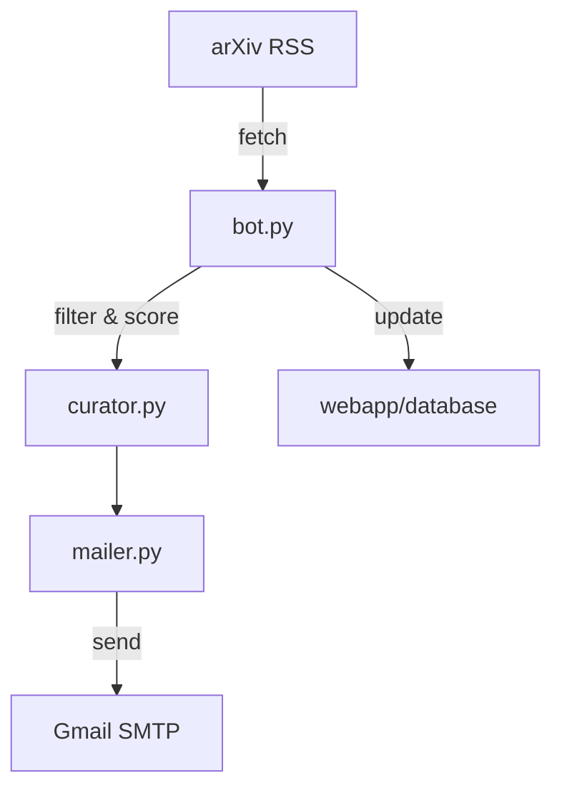

<p align="center">
  
</p>

<p align="center">
  <a href="https://github.com/ajdavis25/paper-scraper/actions/workflows/daily_digest.yml">
    
  </a>
  
  
</p>

> built out of spite because stanford gatekept vox charta

---

### WHAT THIS DOES
this bot automatically fetches the latest **arXiv papers**, filters them by **keywords** and **author preferences**, and emails a **daily curated digest** to the mailing list.  

it includes:
- a default topic profile (`defaults.yaml`) for new subscribers  
- personalized scoring logic (based on what you click or like — coming soon)  
- email subscription system (`subscribe` / `unsubscribe` via gmail)  
- daily automation through **github actions**  
- optional **flask dashboard** for managing preferences and feedback  

---

### REPO STRUCTURE
```text
paper_scraper/
├── .github/workflows/               # github actions for automated tasks
│   ├── daily_digest.yml             # runs the daily arXiv curation + email digest pipeline
│   └── renew_watch.yml              # renews gmail push-notification watch token weekly
│
├── assets/                          # branding and static assets (banner, icons, etc.)
│   └── banner.png
│
├── bot.py                           # main entry point for the daily arXiv digest bot
├── config.yaml                      # primary configuration (arXiv filters, SMTP, output options)
├── config.py                        # loads and validates configuration settings
├── curator.py                       # handles paper ranking, keyword filtering, and scoring
├── filters.py                       # keyword matching and scoring logic for relevance ranking
├── mailer.py                        # email-sending helper shared by bot and web app
│
├── shared/                          # shared modules between bot and Flask web app
│   ├── db.py                        # lightweight database connector for feedback tracking
│   ├── mail.py                      # HTML/plaintext email formatting utilities
│   ├── utils.py                     # general helpers (YAML I/O, arXiv query builders, etc.)
│   ├── gmail_auth.py                # OAuth-based gmail API authentication helper
│   └── gmail_push.py                # gmail push-notification setup for Pub/Sub
│
├── scripts/                         # command-line utilities for admin and subscription tasks
│   ├── backfill_user_accounts.py    # retroactively syncs email users into the DB
│   ├── gmail_watch.py               # re-registers gmail watch (used by renew_watch.yml)
│   ├── subscribe_bot.py             # adds new users to the mailing list
│   └── unsubscribe_bot.py           # removes users from the mailing list
│
├── webapp/                          # flask-based web front-end and backend
│   ├── app.py                       # flask application factory / entry point
│   ├── models.py                    # SQLAlchemy ORM models (User, Paper, Preference, etc.)
│   ├── routes_frontend.py           # user-facing routes (index, dashboard, preferences)
│   ├── routes_backend.py            # API endpoints for feedback and subscriptions
│   ├── templates/                   # jinja2 HTML templates for web views
│   ├── static/                      # static front-end assets
│   │   ├── css/style.css            # main site stylesheet
│   │   ├── js/dashboard.js          # handles dashboard interactivity
│   │   ├── js/recommendations.js    # like/dislike event logic for recommended papers
│   │   └── js/subscriptions.js      # subscribe/unsubscribe UI logic
│   ├── user_feedback.txt            # plaintext fallback log for user feedback (optional)
│   └── user_prefs.yaml              # stores user preference data (keywords, authors, etc.)
│
├── notebooks/                       # jupyter notebooks for prototyping and dev notes
│   └── notes.ipynb
│
├── vercel.json                      # deployment configuration for vercel hosting
├── render.yaml                      # alternate deployment configuration (Render.com)
├── requirements.txt                 # python dependencies
└── README.md                        # this
```

---

### CONFIGURATION FILES
two local YAML files control how the bot behaves:
- `config.yaml`
  - defines which arXiv categories to scrape, scoring thresholds, and email / SMTP settings.
- `defaults.yaml`
  - default topic filters and authors applied to new subscribers

these files are **not tracked by git.**

---

### HOW TO RUN LOCALLY

1. clone this repo:
   ```bash
   `git clone https://github.com/ajdavis25/paper-scraper.git`
   `cd paper_scraper`
   ```
2. create a virtual environment:
    ```bash
    `python -m venv venv`
    `.\venv\Scripts\Activate.ps1`
    ```

3. install dependencies:
    ```bash
    `pip install -r requirements.txt`
    ```

4. create a .env file:
    `EMAIL_FROM=youremail@gmail.com`
    `EMAIL_PASS=your_app_password`
    ### *NOTE:* gmail app passwords are **NOT** your real password.
    create one under:
        google account -> security -> app passwords
    
5. run the bot:
    ```bash
    python bot.py
    ```

---

### WEB DASHBOARD
to view or manage subscriptions through a browser:

```bash
python -m flask --app webapp.app run --debug
```

then open [http://localhost:5000](http://localhost:5000)

the dashboard lets you:
- view your daily digests
- edit keyword / author preferences
- send feedback

> vercel deploys automatically using the same entrypoint (`application = app`)

---

### EXAMPLE config.yaml

```yaml
arxiv:
  categories: [astro-ph.CO, astro-ph.EP, astro-ph.GA, astro-ph.HE, astro-ph.IM, astro-ph.SR]
  max_results: 100
  days_back: 1

preferences:
  any_keywords: [EHT, event horizon telescope, Sgr A*, M87, MHD, GRMHD, black hole, jet, accretion]
  exclude_keywords: [education, review, tutorial]
  authors: [Anantua, Curd, Järvelä, Quataert, Gebhardt]
  min_score: 1.0

output:
  email:
    from_addr: thearxivpaperscraper@gmail.com
    subject_prefix: "[arxiv digest]"
```

---

### HOW TO SUBSCRIBE/UNSUBSCRIBE
- **visit** https://paperscraper-one.vercel.app/ or
- **subscribe:** send an email with the subject `subscribe` to `thearxivpaperscraper@gmail.com`
- **unsubscribe:** send an email with the subject `unsubscribe`

the bot will automatically update the mailing list and send a welcome/farewell message

---

### DEFAULT TOPICS
by default, new users will receive digests including:

```yaml
any_keywords:
  - black hole
  - neutron star
  - accretion
  - jet
  - AGN
  - galaxy
  - cosmology
  - exoplanet
  - star formation
  - polarization
  - GRMHD
  - radiative transfer
authors:
  - Anantua
  - Curd
  - Gußmann
  - Quataert
  - Blandford
  - Tchekhovskoy
  - Narayan
  - Event Horizon Telescope
```

---

### DEPARTMENT SETUP (for admins)
if you're setting this up for a department or research group:

1. create a gmail account for the bot (e.g. `thearxivpaperscraper@gmail.com`)

2. enable **app passwords** in the google account and create one for “mail”.

3. in your forked github repo, go to:  
   **settings -> secrets and variables -> actions -> new repository secret**
   - `EMAIL_FROM` = the bot’s gmail address  
   - `EMAIL_PASS` = the app password from step 2

4. the bot will automatically run daily at **8 am central** and email all subscribed users.  
   to test manually, go to the **actions** tab and run **“daily arxiv digest”** using the “run workflow” button.

> optional: to enable subscription emails, upload your gmail API `credentials.json` and `token.json` inside a `secrets/` folder (not tracked by git).

---

### EXTENDING THE BOT
want to modify how the bot works? here’s how to extend or customize it safely:

#### change the daily run time
open `.github/workflows/daily_digest.yml` and update the `cron` line:

```yaml
on:
  schedule:
    - cron: "0 13 * * *"  # 8am central
```

the `13` here means `1300 utc = 8:00 am central`
to run at 9am central, change it to `"0 14 * * *"`

### add or adjust topics
edit `defaults.yaml` (used for new subscribers) or your own `config.yaml` to update the keyword filters:

```yaml
any_keywords:
  - black hole
  - neutron star
  - exoplanet
  - high-energy astrophysics
authors:
  - Anantua
  - Blandford
  - Quataert
```

you can make these as broad or specific as you like. the bot scores each paper based on keyword frequency and relevance.

#### add new filters
custom logic lives in `filters.py`
for example, to exclude reviews or tutorials automatically, you can add:

```python
EXCLUDE_TERMS = ["review", "tutorial", "conference summary"]

def is_relevant(paper, prefs):
    title = paper["title"].lower()
    if any(term in title for term in EXCLUDE_TERMS):
        return False
    return True
```

#### customize the email template
html and plain-text bodies are built in `mailer.py`
you can tweak formatting, add emojis, or include links to institutional papers easily.

#### architecture overview


#### for developers
tested with **python 3.11+**

run linting / debugging locally:

```bash
python -m flask --app webapp.app run --debug
pytest -q
```

- flask backend (in `webapp/`) can be used for future user dashboards or manual curation.
- the bot is modular: new sources (ADS, NASA, etc.) can be integrated with new parser modules under `parsers.py`.
- PRs are welcome - just don't break the 8am cst vibe.

---

### SECURITY
- please don't commit `.env`, `config.yaml`, or anything under `secrets/`.
- gmail API tokens (`token.json`) should remain private.
- all sensitive files are ignored via `.gitignore` and `.vercelignore`.

---

### LICENSE

**MIT License © 2025 Ashton Davis**

---

### CREDITS
independent project built by ashton davis (utsa physics, m.s. student)
runs daily at 8:00 am cst via github actions.
this project is open-source and hackable, PRs welcome.

have fun, and bite me stanford!
